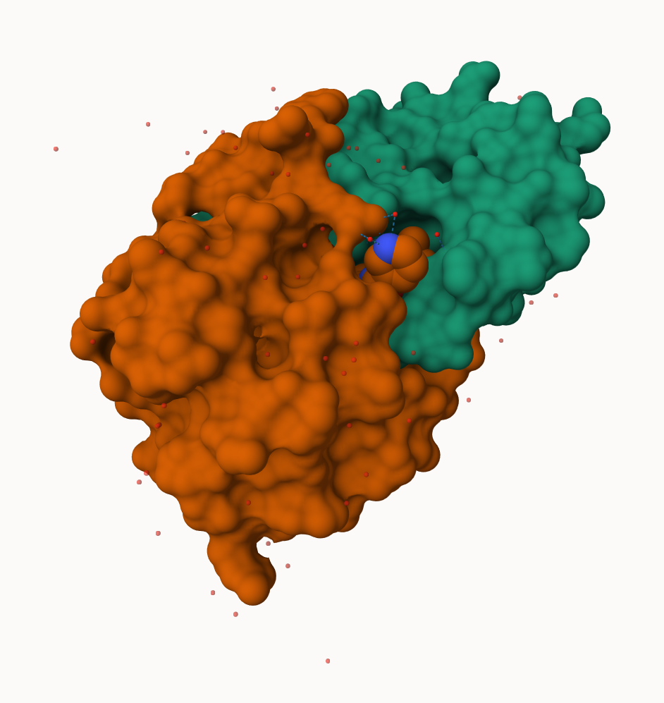
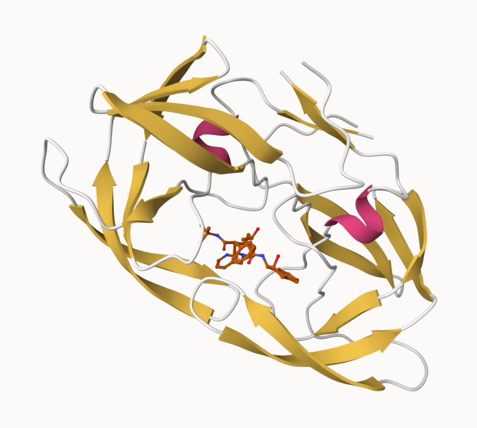
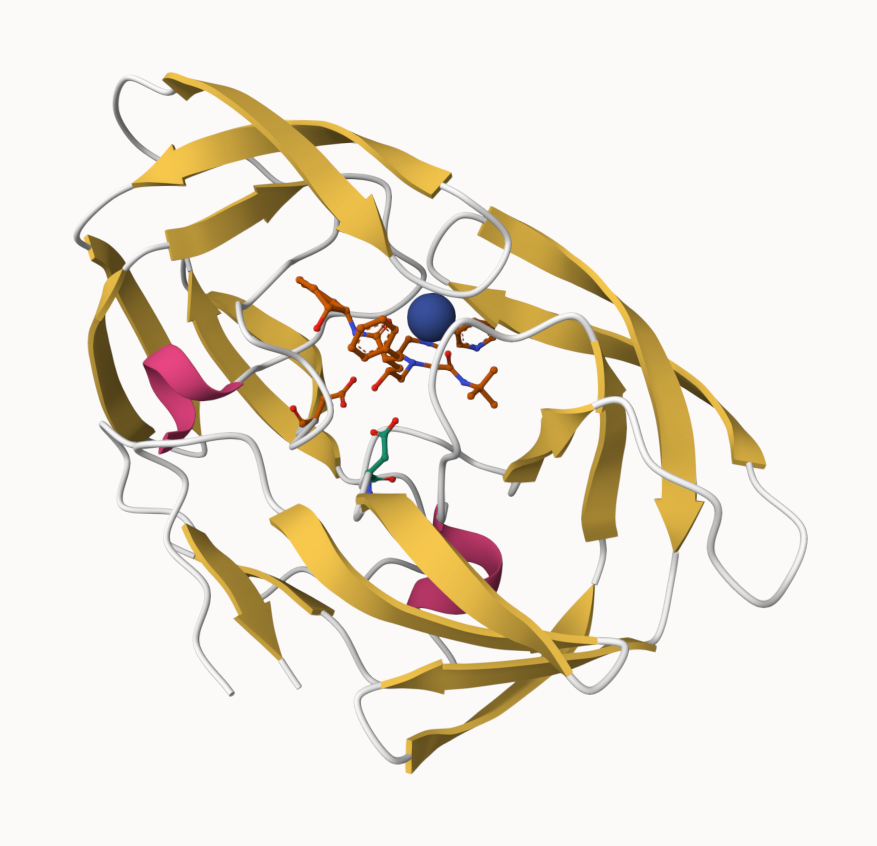
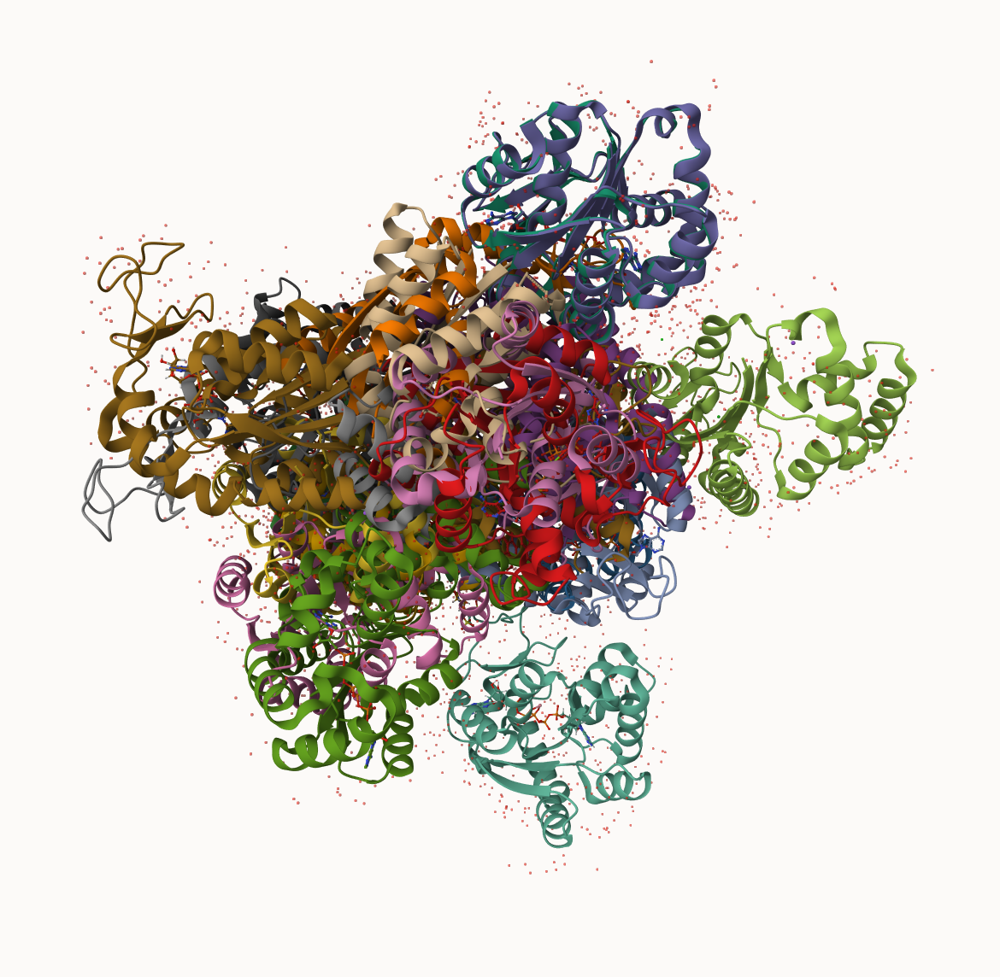

## The PDB database

The PDB\[http://www.rcsb.org/\] is the main repository of biomolecular structure data. Let's see what is in it:

```{r}
stats<-read.csv("pdb_stats.csv", row.names=1)
```

Q1: What percentage of structures in the PDB are solved by X-Ray and Electron Microscopy.

```{r}

n.sums<-colSums(stats)
round(n.sums/n.sums["Total"],4)

```

> What is the total number of entries in the PDB?

```{r}
n.sums["Total"]
```

Q2: What proportion of structures in the PDB are protein?

```{r}
(stats$Total[1])/sum(stats$Total)
```

## Using Molstar

We can use the main [Molstar viewer online](https://molstar.org/viewer/)



> Q Generate and insert an image of the HIV-Pr cartoon colorted by seconday structure, showing the inhibitor (ligand) in ball and stick.



> Q Highlight A25 and the critical water at the binding site



## The Bio3D package for structural bioninformatics

```{r}
library(bio3d)

hiv<-read.pdb("1hsg")
hiv
```

```{r}
head(hiv$atom)
```

```{r}
pdbseq(hiv)
```

Let's try out the new **bio3dview** package that is not yet on CRAN. We can use the **remotes** package to install any R package from Github.

install.packages("remotes") remotes::install_github("bioboot/bio3dview") install.packages("N)

```{r}
library(bio3dview)
library(NGLVieweR)
```

```{r}
#sele <- atom.select(pdb, resno=25)

# and highlight them in spacefill representation
#view.pdb(pdb, cols=c("navy","teal"), 
#         highlight = sele,
#         highlight.style = "spacefill") |>
#  setRock()
```

## Prediction

```{r}
adk<-read.pdb("6s36")
m<-nma(adk)

plot(m)
```

Write out our results as a trajecotry movie:

```{r}
mktrj(m,file="results.pdb")
```

## Comparative analysis with PCA

First step find an ADK sequence:

```{r}
library(bio3d)

id<-"1ake_A" ## change this to run a different analysis
aa <- get.seq(id)
```

Next step is searching the PDB database for all related entries:

```{r}
blast<-blast.pdb(aa)
hits<-plot(blast)

```

All the blast results

```{r}
head(blast$hit.tbl)
```

The "top hits" are listed in the `hits` object. Now we can dowload these to our computer.

```{r}
#download related PDB files
files<-get.pdb(hits$pdb.id, path="pdbs",split=TRUE, gzip=TRUE
                 )

```



Next we will use the `padaln()` function to align and also optionally fit (ie superpose) the identified PDB structures.

This requires a BioConductor package called "msa" that we need to install. First we install BiocManager. Then we use `BiocManager::install("msa")`

install.packages("BiocManager")

```{r}
pdbs<-pdbaln(files, fit=TRUE,exefile="msa")
```

We could view these in R with **bio3dview** `view.pdbs()` function

```{r}
library(bio3dview)
view.pdbs(pdbs, colorScheme="residue")
```

## PCA

Anyways we are going to work on PCA using `pca()`

```{r}
pc.xray<-pca(pdbs)
plot(pc.xray, 1:2)
```

We can make a visualization of the major conformational difference (ie large scale structure change) captured by our PCA analysis with thr `mktrj()` function.

```{r}
#pc1<-mktrj(pc.xray, file="pca.pdb")
```

Let's see in Mol\*

```{r}

```

```{r}
library(ggrepel)

df <- data.frame(PC1=pc.xray$z[,1], 
                 PC2=pc.xray$z[,2], 
                 col=as.factor(grps.rd),
                 ids=ids)

p <- ggplot(df) + 
  aes(PC1, PC2, col=col, label=ids) +
  geom_point(size=2) +
  geom_text_repel(max.overlaps = 20) +
  theme(legend.position = "none")
p
```

## Before the class

Q3: Type HIV in the PDB website search box on the home page and determine how many HIV-1 protease structures are in the current PDB?

4940

Q4: molecules normally have 3 atoms. Why do we see just one atom per water molecule in this structure?

All protein folding need water but we mask them when looking at protein structure because it is overwhelming. The molecule is simplified to one unit, instead of all atoms.

Q5: There is a critical “conserved” water molecule in the binding site. Can you identify this water molecule? What residue number does this water molecule have

Q6: Generate and save a figure clearly showing the two distinct chains of HIV-protease along with the ligand. You might also consider showing the catalytic residues ASP 25 in each chain and the critical water (we recommend “Ball & Stick” for these side-chains). Add this figure to your Quarto document.


```{r}
library(bio3d)

pdb <- read.pdb("1hsg")

pdb
```

```{r}
attributes(pdb)
```

Q7: How many amino acid residues are there in this pdb object? Q8: Name one of the two non-protein residues? Q9: How many protein chains are in this structure?

```{r}
length(pdb$seqres)
unique(pdb$atom$resid)
length(unique(pdb$atom$chain))

```

```{r}
library(bio3dview)
library(NGLVieweR)

#view.pdb(pdb) |>
#  setSpin()

sele <- atom.select(pdb, resno=25)

# and highlight them in spacefill representation
#view.pdb(pdb, cols=c("navy","teal"), 
#         highlight = sele,
#         highlight.style = "spacefill") |>
#  setRock()


```

```{r}
adk <- read.pdb("6s36")
m <- nma(adk)
plot(m)


```

```{r}
#mktrj(m, file="adk_m7.pdb")
#view.nma(m, pdb=adk)

```

Q10. Which of the packages above is found only on BioConductor and not CRAN? msa

Q11. Which of the above packages is not found on BioConductor or CRAN?: bio3dview

Q12. True or False? Functions from the pak package can be used to install packages from GitHub and BitBucket? TRUE

```{r}
aa <- get.seq("1ake_A")
aa
```

Q13. How many amino acids are in this sequence, i.e. how long is this sequence? 214

```{r}
hits <- NULL
hits$pdb.id <- c('1AKE_A','6S36_A','6RZE_A','3HPR_A','1E4V_A','5EJE_A','1E4Y_A','3X2S_A','6HAP_A','6HAM_A','4K46_A','3GMT_A','4PZL_A')
```

```{r}
files <- get.pdb(hits$pdb.id, path="pdbs", split=TRUE, gzip=TRUE)
pdbs <- pdbaln(files, fit = TRUE, exefile="msa")

```

```{r}
ids <- basename.pdb(pdbs$id)

anno <- pdb.annotate(ids)
unique(anno$source)
```

```{r}
pc.xray <- pca(pdbs)
plot(pc.xray)
```

```{r}
rd <- rmsd(pdbs)

# Structure-based clustering
hc.rd <- hclust(dist(rd))
grps.rd <- cutree(hc.rd, k=3)

plot(pc.xray, 1:2, col="grey50", bg=grps.rd, pch=21, cex=1)
```
