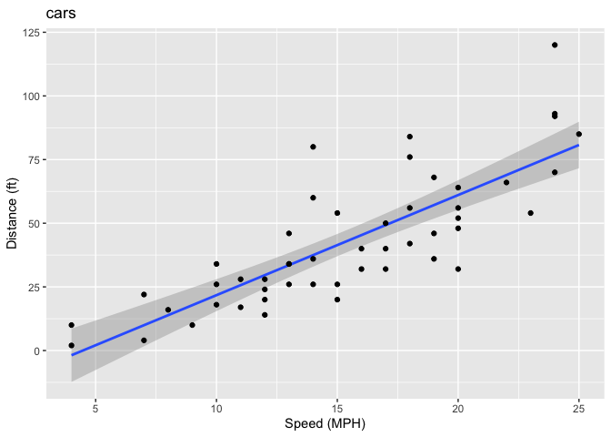
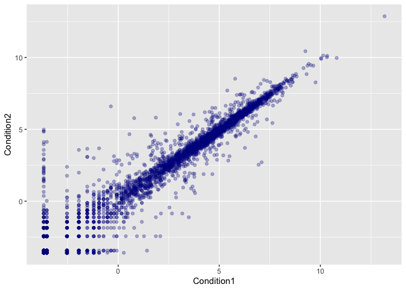
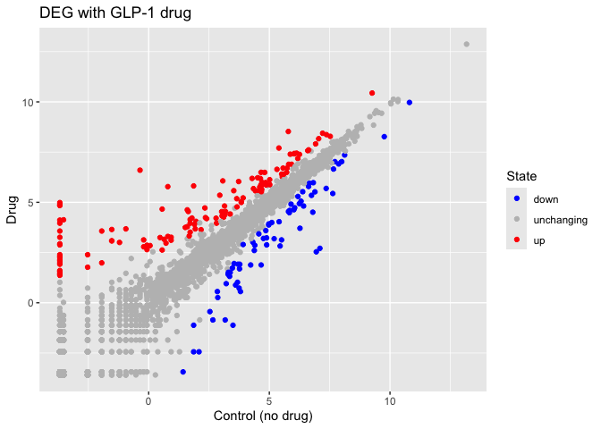
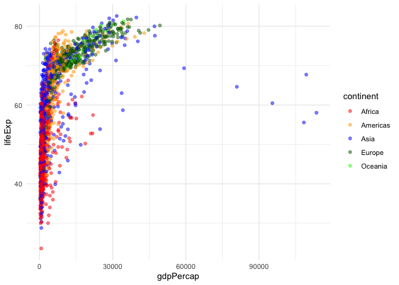
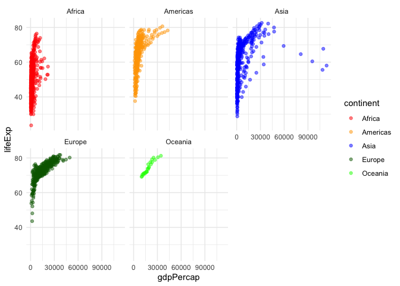
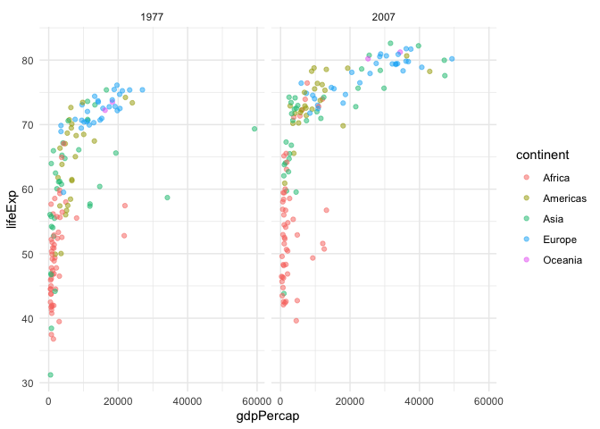

# class05
Chen

- [Background](#background)
- [Gene Expression Plot](#gene-expression-plot)
- [Going further with gapmider](#going-further-with-gapmider)
- [First look at the `dplyr` package](#first-look-at-the-dplyr-package)

## Background

There are lots of ways to make plots in R. These include so-called “base
R” (like the `plot()`) and on packages like **ggplot2**.

Let’s make the sampe plot with these two graphics systems. We can use
the inbuilt `cars` dataset:

shortcut: option+command+i(insert)

``` r
head(cars)
```

      speed dist
    1     4    2
    2     4   10
    3     7    4
    4     7   22
    5     8   16
    6     9   10

With “base R” we can simply

``` r
plot(cars)
```


Now let’s try ggplot. First I need to install the package using
`install.packages("ggplot2")`.

> **N.B.** We never run an `install.packages()` in a code chunl
> otherwise we will reinstall needlessly every time we render the
> document.

Every time we want to use an add=on package we need to load it up with a
call to `library()`

``` r
library(ggplot2)
ggplot(cars)
```


Every ggplot needs at least 3 things: 1. the **data** ie stuff to plot
as a data.fra,e 2. the **aes** or aesthetics thaat map the data to the
plot 3. the **geom\_** or geometry ie the plot type such as points,
lines etc.

``` r
ggplot(data=cars)+
  aes(x=speed,y=dist)+
  geom_smooth(method="lm", sep=FALSE)+
  geom_point()+
  labs(x="Speed (MPH)", y="Distance (ft)",title="cars")
```

    Warning in geom_smooth(method = "lm", sep = FALSE): Ignoring unknown
    parameters: `sep`

    `geom_smooth()` using formula = 'y ~ x'



## Gene Expression Plot

Read some data on the effects of GLP-1 inhibitor (drug) on exprsesion
values

``` r
url <- "https://bioboot.github.io/bimm143_S20/class-material/up_down_expression.txt"
genes <- read.delim(url)
head(genes)
```

            Gene Condition1 Condition2      State
    1      A4GNT -3.6808610 -3.4401355 unchanging
    2       AAAS  4.5479580  4.3864126 unchanging
    3      AASDH  3.7190695  3.4787276 unchanging
    4       AATF  5.0784720  5.0151916 unchanging
    5       AATK  0.4711421  0.5598642 unchanging
    6 AB015752.4 -3.6808610 -3.5921390 unchanging

``` r
nrow(genes)
```

    [1] 5196

``` r
ncol(genes)
```

    [1] 4

``` r
ggplot(genes)+
  aes(x=Condition1, y=Condition2)+
  geom_point(col="darkblue", alpha=0.3)
```



Let’s color by `state` up, down or no change

``` r
head(genes$State)
```

    [1] "unchanging" "unchanging" "unchanging" "unchanging" "unchanging"
    [6] "unchanging"

``` r
table(genes$State)
```


          down unchanging         up 
            72       4997        127 

``` r
table(genes$State)/sum(table(genes$State))
```


          down unchanging         up 
    0.01385681 0.96170131 0.02444188 

``` r
ggplot(genes)+
  aes(x=Condition1, y=Condition2, col=State)+
  geom_point()+
  scale_colour_manual( values=c("down"="blue","unchanging"="gray","up"="red") )+
  labs(x="Control (no drug)",y="Drug",title="DEG with GLP-1 drug")
```



## Going further with gapmider

Here we explore the famous `gapminder` dataset with some custom plots.

``` r
url <- "https://raw.githubusercontent.com/jennybc/gapminder/master/inst/extdata/gapminder.tsv"

gapminder <- read.delim(url)

head(gapminder)
```

          country continent year lifeExp      pop gdpPercap
    1 Afghanistan      Asia 1952  28.801  8425333  779.4453
    2 Afghanistan      Asia 1957  30.332  9240934  820.8530
    3 Afghanistan      Asia 1962  31.997 10267083  853.1007
    4 Afghanistan      Asia 1967  34.020 11537966  836.1971
    5 Afghanistan      Asia 1972  36.088 13079460  739.9811
    6 Afghanistan      Asia 1977  38.438 14880372  786.1134

> Q. How many rows?

``` r
nrow(gapminder)
```

    [1] 1704

> Q how many countinents?

``` r
length(table(gapminder$continent))
```

    [1] 5

``` r
length(unique(gapminder$continent))
```

    [1] 5

Version 1 plot: gdpPercap vs lifeExp for all rows

``` r
ggplot(gapminder, aes(gdpPercap,lifeExp, col=continent))+
  geom_point(alpha=0.5)+
  theme_minimal()+
  scale_colour_manual( values=c("Asia"="blue","Europe"="darkgreen","Africa"="red","Americas"="orange","Oceania"="green") )
```



I want to see a plot for each continent - in ggplot lingo this is called
“faceting”

``` r
ggplot(gapminder, aes(gdpPercap,lifeExp, col=continent))+
  geom_point(alpha=0.5)+
  theme_minimal()+
  scale_colour_manual( values=c("Asia"="blue","Europe"="darkgreen","Africa"="red","Americas"="orange","Oceania"="green") )+
  facet_wrap(~continent)
```



## First look at the `dplyr` package

Another add-on package with a function called `filter()` that we want to
use.

``` r
library(dplyr)
```


    Attaching package: 'dplyr'

    The following objects are masked from 'package:stats':

        filter, lag

    The following objects are masked from 'package:base':

        intersect, setdiff, setequal, union

``` r
sub_gap<-gapminder %>%
  filter(year==2007, country=="Ireland")
sub_gap
```

      country continent year lifeExp     pop gdpPercap
    1 Ireland    Europe 2007  78.885 4109086     40676

``` r
gap_sub<-filter(gapminder, year==2007|year==1977)

ggplot(gap_sub,aes(gdpPercap,lifeExp, col=continent))+
  geom_point(alpha=0.5)+
  theme_minimal()+
  facet_wrap(~year)
```


